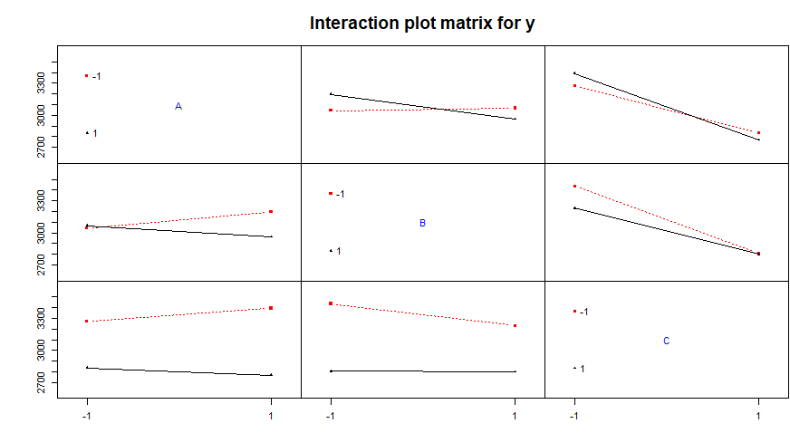
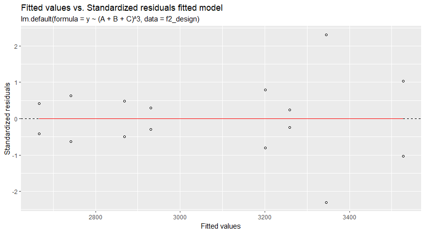

# TMA4267-Linstat
TMA4267 Linear Statistical Models, https://www.math.ntnu.no/emner/TMA4267/2023v/
## Abstract
This study aimed to investigate the effects of cook time, washing soda concentration, and water
volume on the softness of homemade noodles using a Design of Experiments (DoE) approach. A
full factorial experimental design was employed to examine the main effects and interactions of the
factors. A linear regression model was fitted to the experimental data, and its goodness of fit was
assessed. However, the model was found to be a poor fit for the data, with insignificant predictor
variables and interactions, low R-squared and adjusted R-squared values, and a large residual
standard error. Several sources of error were identified in the experiment, potentially impacting
the accuracy and reliability of the results. The study concluded that the current model does not
provide meaningful insights into the effects of cook time, washing soda concentration, and water
volume on noodle softness. Further investigation, with careful consideration of experimental error
sources and conducting multiple trials, is necessary to optimize the noodle-making process and
better understand the relationships between these factors and noodle softness.

